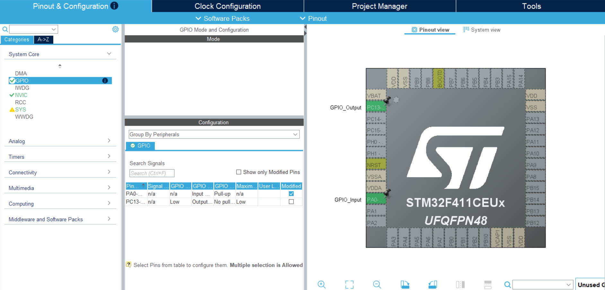

# 1 — LED Blink (Onboard)


> Learn how to use GPIOs on the STM32 Black Pill — read a button input and control an onboard LED based on the button state.

---

## 🛠️ Hardware Required

| Component | Quantity |
| :--- | :--- |
| STM32F411CEU6 (Black Pill) | 1 |
| STLink V2 | 1 |

> Both the push button and the LED used here are **onboard** — no external components needed.

---

## 🔌 Circuit & Wiring

| Black Pill Pin | Connected To | Function |
| :--- | :--- | :--- |
| `PA0` | Onboard Push Button | GPIO Input |
| `PC13` | Onboard LED | GPIO Output |

---

## ⚙️ STM32CubeMX Configuration



Start with the **default configuration** and apply the following changes:

**Pinout & Configuration:**
- Click `PC13` → Set as `GPIO_Output` — User Label: `ONBOARD_LED`
- Click `PA0` → Set as `GPIO_Input` — User Label: `USER_BUTTON`

**System Core → GPIO:**
- Select `PA0` → Set **GPIO Pull-up/Pull-down** to `Pull-up`

---

## 🧠 Core Logic & HAL APIs

**Behavior:** LED turns ON when the button is pressed, and turns OFF when released.

```c
while (1)
{
    /* PA0 is configured in Pull-Up mode */
    if (HAL_GPIO_ReadPin(GPIOA, GPIO_PIN_0) == GPIO_PIN_SET)
    {
        HAL_GPIO_WritePin(GPIOC, GPIO_PIN_13, GPIO_PIN_SET);
    }
    else
    {
        HAL_GPIO_WritePin(GPIOC, GPIO_PIN_13, GPIO_PIN_RESET);
    }
}
```

- When the button is pressed → `HAL_GPIO_ReadPin` returns `GPIO_PIN_SET` (HIGH) → LED turns ON
- When the button is released → pin reads `GPIO_PIN_RESET` (LOW) → LED turns OFF

---

## 📝 Concepts & Gotchas

### 💡 Why does `GPIO_PIN_RESET` turn the LED ON?

This is a common point of confusion for beginners. Look at the onboard LED circuit on the Black Pill [schematic](https://stm32-base.org/assets/pdf/boards/original-schematic-STM32F411CEU6_WeAct_Black_Pill_V2.0.pdf):

```
3.3V ──── [LED] ──── PC13
```

One terminal of the LED is permanently connected to **3.3V**, and the other terminal is connected to **PC13**. This means:

- When `PC13` is **LOW (RESET)** → there is a voltage difference across the LED → **current flows → LED glows**
- When `PC13` is **HIGH (SET)** → both ends are at ~3.3V → no voltage difference → **LED is OFF**

This wiring style is called **Current Sink mode**.

---

### 🔁 Sink Mode vs. Source Mode

| Mode | Wiring | LED ON When |
| :--- | :--- | :--- |
| **Sink** | LED connects from VCC → GPIO pin | GPIO pin is **LOW** |
| **Source** | LED connects from GPIO pin → GND | GPIO pin is **HIGH** |

The onboard LED on the Black Pill operates in **Sink mode**, which is why `GPIO_PIN_RESET` activates it. Many microcontroller boards use sink mode because GPIO pins can typically sink more current reliably than they can source it.

---

### 🔘 Why is PA0 Configured as Pull-Up? — Floating Pins Explained

When a GPIO pin is configured as an input and **nothing is actively driving it HIGH or LOW**, the pin is said to be **floating** (also called high-impedance or Hi-Z). A floating pin picks up random electrical noise from the environment and toggles unpredictably between HIGH and LOW — making your reading completely unreliable.

To fix this, you need to tie the pin to a known default voltage using a resistor.

**Three input states:**

```
                  3.3V
                   │
               [Pull-up R]        ← internal ~40kΩ resistor inside STM32
                   │
PA0 ───────────────┤
                   │
               [Button]
                   │
                  GND
```

| Configuration | Default State (button open) | When Button Pressed |
| :--- | :--- | :--- |
| **Floating** | Unknown / noisy | Unreliable |
| **Pull-Up** | HIGH (3.3V) | LOW (pulled to GND) |
| **Pull-Down** | LOW (GND) | HIGH (pulled to 3.3V) |

**Why Pull-Up and not Pull-Down or Floating?**

The onboard button on the Black Pill is wired so that pressing it connects `PA0` to **GND**. This means:

- Without any resistor, the pin floats when the button is open → unreliable
- With a **Pull-Up** resistor, the pin sits at a solid **HIGH** when the button is open, and goes **LOW** when pressed → clean, predictable readings ✅
- A **Pull-Down** would work if the button connected the pin to VCC instead — but that's not how this button is wired

The STM32 has built-in internal pull-up and pull-down resistors (~40kΩ), so you simply enable them through CubeMX — no external resistor needed.

---

## 📚 References

- [WeAct Black Pill V2.0 - STM32-Base](https://stm32-base.org/boards/STM32F411CEU6-WeAct-Black-Pill-V2.0.html#User-button)

- [schematic](https://stm32-base.org/assets/pdf/boards/original-schematic-STM32F411CEU6_WeAct_Black_Pill_V2.0.pdf)